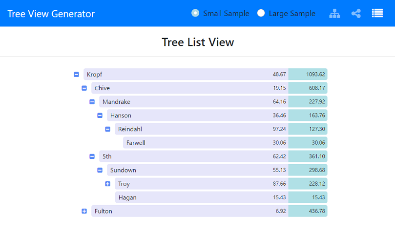
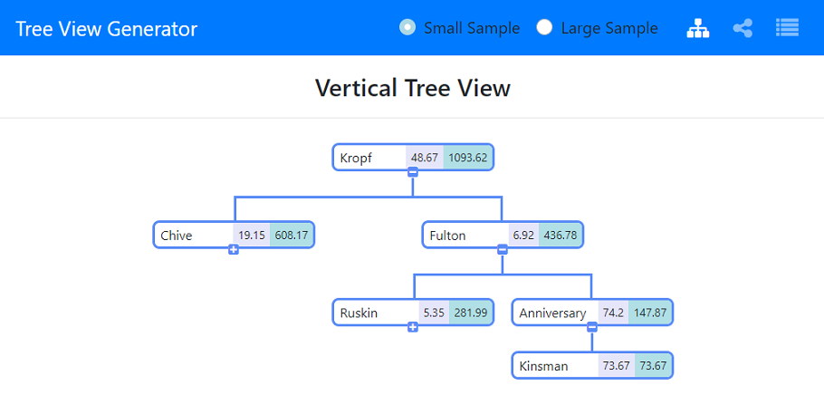
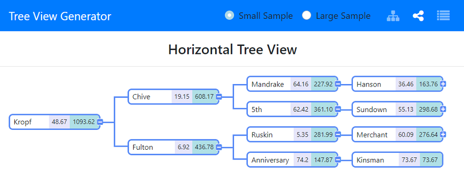

# Tree View Generator

### Deployed Application
[https://gveetil.github.io/Tree-View-Generator/](https://gveetil.github.io/Tree-View-Generator/)
<br>

## Description 

<br><br>

This application generates tree views based on data loaded up from a csv file. It is built as a solution for the below challenge.
<br>

## The Challenge:
Develop an application that loads a csv file containing 1000 rows of tree structure data.
The application then needs to display this hierarchical data and calculate the total value of each node as detailed below:

```
Example:
           Input:
                       Parent 1 - 0.10
                       -          Child 1 - 0.20
                       --                     Child 1-1 - 0.30
           Output:
                       Parent 1 - 0.60
                       -          Child 1 - 0.50
                       --                     Child 1-1 - 0.30
```
<br>

## Table of Contents 

- [Technical Features](#technical-features)
- [Usage Guidelines](#usage-guidelines)
- [Known Issues](#known-issues)
<br><br>

## Technical Features

The Tree View Generator is built purely using React and Bootstrap. Sample data for the application is loaded from two csv files which can are located in the `src > data` folder. The application is currently published as a static site on GitHub Pages. <br>

## Usage Guidelines

When the Tree View Generator application is loaded, it displays the below list view by default:<br>

<br><br>

* To expand or collapse a node, click the `+` and `-` buttons.
* To load the complete data (1000 rows), select large sample radio button from the top navigation bar.
* To view a smaller data set, select small sample radio button from the top navigation bar. This is the default selection.
* To view the data in a vertical tree layout, click the vertical tree button from the top navigation bar.This will display the below view:<br>

<br><br>

* To view the data in a horizontal tree layout, click the horizontal tree button from the top navigation bar. This will display the below view:<br>

<br><br>

  
## Known Issues
This application is not Responsive and is not mobile friendly. 
